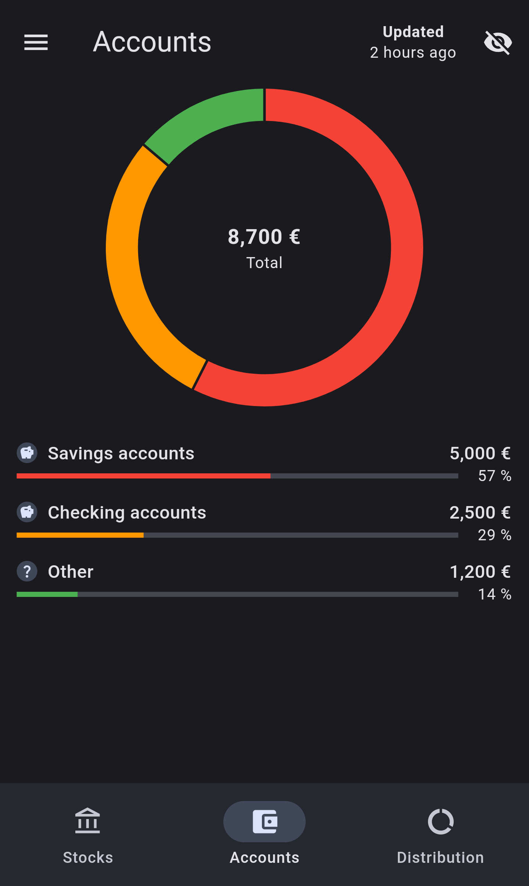
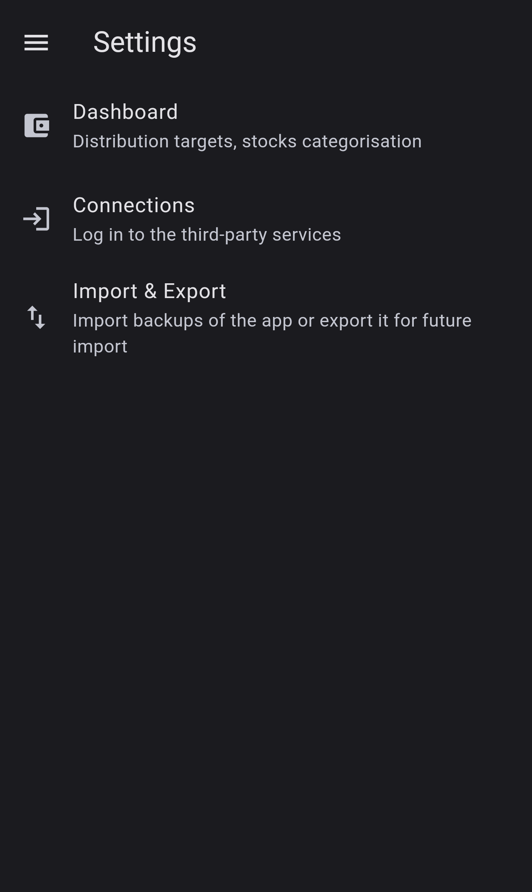

# Finance

App using [Finary](https://finary.com/)'s backend to provide an alternative dashboard visualisation to finance related data. This project was created for my specific needs and might not be useful to you.
New features may come in the future, when my needs expand/change.

## Installation

The recommended way to keep this app updated is through [Obtainium](https://github.com/ImranR98/Obtainium). 
First, manually install the app by downloading the latest APK from the [releases](https://github.com/V4ldum/finance/releases). This is useful to guarantee the app is signed with the correct certificate (mine) and was not injected with malware.
Then, you can download Obtainium and add my app inside using the GitHub link. Obtainium will see the app installed and will be able to update it from there.

## Screenshots

|  |  |
|---------------------------------------------------------------------|-------------------------------------------------------------------| 

